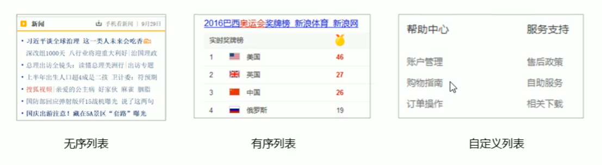
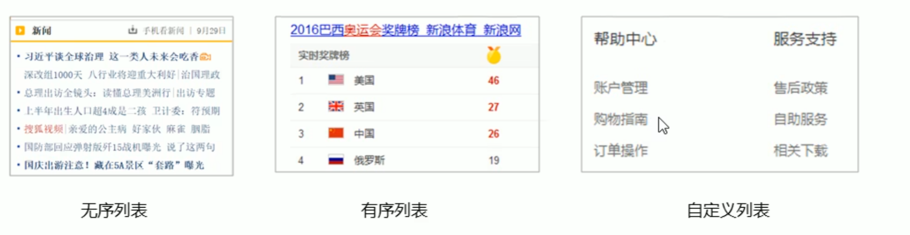

# HTML

### 什么是网页

网页是指构成网站的**基本元素**

网页是构成网站的基本元素,它通常由图片、链接、字音、视频等元素组成，其实就是一个html文件。

__HTML:__超文本标记语言  标签组成

# Web 标准

Web标准是由__W3C__组织和其他标准化组织制定的一系列标准的集合。W3C (万维网联盟)是国际最著名的标准化组织。

## Web 标准构成

主要包括：结构( Structure)、表现( Presentation )和行为( Behavior )三个方面。

| 标准 | 说明                                                         |
| :--- | :----------------------------------------------------------- |
| 结构 | 结构用于**网页**元素进行整理和分类 HTML   举个🌰：**出生的幼鸟** |
| 表现 | 表现用于设置网页元素的版式、颜色、大小等外观样式，主要指的是CSS   🌰： **长出羽毛**的小鸟🪶 |
| 行为 | 行为是指网页模型的定义及交互的编写,现阶段主要学的是 Java script     🌰：学会**飞行 ** 🦅 |

Web标准提出的最佳体验方案:**结构、样式、行为相分离。**
简单理解:*结构写到 HTML文件中，表现写到CSS文件中，行为写到 JavaScript文件中。*


### 1. HTML语法

> HTML标签是由尖括号包围的关键词,例如<html>。
>
> * HTML 标签通常是成对出现的,例妇<html>和<**/**html>,我们称为**双标签**。标签对中的第一个标签是
>   开始标签,第二个标签是结束标签。
>
>   > **包含关系(父子关系)    并列关系**
>
> * 有些特殊的标签必须是单个标签 (极少情况),例如 **<br/>**

| 标签名           | 定义       | 说明                                                   |
| ---------------- | ---------- | ------------------------------------------------------ |
| <HTML></HTML>    | HTML标签   | 页面中最大的标签， 根标签                              |
| <head></head>    | 文档的头部 | 注意在head标签中我们必须要设置的标签是title            |
| <titile></title> | 文档的标题 | 让页面拥有一个属于自己的网页标题                       |
| <body></body>    | 文档的主体 | 元素包含文档的所有内容，页面内容基本都是放到body里面的 |

```html
< ! DOCTYPE html >    <-- 当前页面采取的是HTML5版本来显示网页 -->
注：
声明位于文档中的最前面的位置,处于<html>标签之前。
<!DOCTYPE>不是一个HTML标签,它就是文档类型声明标签。
```

lang 语言种类

### 2. 标签语义

#### 文本

学习标签是有技巧的,**重点是记住每个标签的语义。**简单理解就是指标签的含义,即这个标签是用来干嘛的。
**根据标签的语义,在合适的地方给一个最为合理的标签 ,可以让页面结构更清晰。**

> 标题标签：
>
>  1. <h1>一级标题  单词head的缩写</h1>  一共六级 依次递减 

>  段落标签 换行标签
>
> >a. <p> paragraph </p>   
> >
> >b. **文本自动换行**  **段落和段落之间有空隙**
> >
> >c. <br/>

#### 文本格式化

🌰: **加粗**     *斜体*    <u>下划线</u>

| 语义   | 标签                         | 说明                                  |
| ------ | ---------------------------- | ------------------------------------- |
| 加粗   | <strong></strong>或者<b></b> | 更推荐使用<strong> 标签加粗语义更强烈 |
| 倾斜   | <em></em>或者<i></i>         | 更推荐使用<em>标签加粗语义更强烈      |
| 删除线 | <del></de>或者<s></s>        | 更推荐使用<del>标签加粗语义更强烈     |
| 下划线 | <ins></ins>或者<u></u>       | 更推荐使用<ins>标签加粗语义更强烈     |

**<div> 和 <span> 标签  无语义  盒子 division ：分割 、分区   大盒子 现在一行只可以放一个   <span> 一行可以放多个 小盒子**

------

### 图像标签和路径


| 属性   | 属性值   | 说明                               |
| ------ | -------- | ---------------------------------- |
| src    | 图片路径 | 必须属性                           |
| alt    | 文本     | 替换文本。当图像不显示时，显示文本 |
| title  | 文本     | 提示文本，鼠标悬停时，显示文字     |
| width  | 像素     | 设置宽                             |
| height | 像素     | 高                                 |
| border | 像素     | 边框                               |

> * 属性之间不分先后顺序,标签名与属性、属性与属性之间均以空格分开。
> * 属性采取键值对的格式，即key= "value" 的格式, 属性= "属性值”



#### 超链接标签   

###  anchor：锚

```html
<a href="url"  target="目标窗口的弹出方式" ></a>
```

**链接分类：**

> * 外部链接:例如< a href= *http:// www.baidu.com">百度</a>.
> * 内部链接:网站内部页面之间的相互链接直接链接内部页面名称即可,例如< a href="index.html">首页</a>. 
> * 空链接:如果当时没有确定链接目标时, <a href="#">首页</a>。
> * 下载链接:如果href里面地址是一个文件或者压缩包,会下载这个文件。
> * 网页元素链接:在网页中的各种网页元素,如文本、图像、表格、音频、视频等都可以添加超链接.
> * 锚点链接:点我们点击链接，可以快速定位到页面中的某个位置.
>   * 在链接文本的href属性中,设置属性值为#名字的形式,如<a href=”#two">第2集</a>
>   * 找到目标位置标签,里面添加一个id属性=刚才的名字,如: <h3 id="two">第2集介绍</h3>


### 表格标签 ——展示数据

```html
<table>    <!--表格标签 -->
    <tr> 	<!-- 行  必须嵌套在table签里面-->
        <td></td>  <!--table date 单元格内容  必须嵌套在tr里面-->
    </tr>
</table>
```

<th>表头标签   效果加粗并居中

表格属性   实际开发并不常用，通过css设置

| 属性名      | 属性值              | 描述                                        |
| ----------- | ------------------- | ------------------------------------------- |
| align       | left、center、right | 规定相对周围元素的对齐方式                  |
| border      | 1 或者 “”           | 规定表格是否拥有边框，默认“”，表示没有边框  |
| cellpadding | 像素值              | 规定单元格边沿与其内容之间的空白，默认1像素 |
| cellspacing | 像素值              | 规定单元格之间的空白，默认2像素             |
| width       | 像素值或百分比      | 规定表格的宽度                              |

#### 表格结构标签

```html
<thead> </thead> :用于定义表格的头部。<thead>内部必须拥有<tr>标签。-般是位于第一行。
<tbody> </tbody> :用于定义表格的主体,主要用于放数据本体。
以上标签都是放在<table> </table>标签中。
```

**合并单元格**

> * 跨行合并: rowspan= "合并单元格的个数"
> * 跨列合并: colspan="合并单元格的个数”

### 列表标签——布局

> * 表格是用来显示数据的,那么**列表就是用来布局的。**
> * 列表最大的特点就是整齐、整洁、有序,它作为布局会更加自由和方便。
> * 根据使用情景不同,列表可以分为三大类:无序列表、有序列表和自定义列表。



**无序列表**

```html
<ul>
    <li></li>
</ul>
```

< * **<ul> </ul>帜能嵌套<li></li> ,直接在<ul> </ul>标签中输入其他标签或者文字的做法是不被允许的。** **列表标签都是这条规则**

* <li>与</li>之间相当于一个容器,可以容纳所有元素。

**有序列表**

```html
<ol>
    <li>
    </li>
</ol>
```

##### 自定义列表

```html
<dl>
    <dt>名词</dt>
    <dd>解释说明</dd>
    <dd>解释说明</dd>
</dl>
```

### 表单标签

**交互，手收集信息**

在HTML中, 一个完整的表单通常由**表单域、表单控件(也称为表单元素)和提示信息**3个部分构成。

##### 表单域

```html
<form action="url地址”method="提交方式 get/post”name="表单域名称">
    
</form>
```

#### <**input** type="属性值"/> 表单元素

* type属性值以及描述

| 属性值   | 描述                                                         |
| -------- | ------------------------------------------------------------ |
| button   | 点击按钮(多数情况，用于JavaScript启动脚本)                   |
| checkbox | 复选框                                                       |
| file     | 定义输入字段和“浏览”按钮，供文件上传                         |
| hidden   | 隐藏输入字段                                                 |
| image    | 定义图像上传按钮                                             |
| password | 调用密码字段，该字段的字符被掩盖                             |
| radio    | 定义单选按钮                                                 |
| reset    | 定义重置按钮。重置按钮会清除表单中的所有数据                 |
| submit   | 定义提交按钮。提交按钮会把表单数据发送到服务器。             |
| text     | 定义单行的输入字段，用户可在其中输入文本。默认宽度为20个字符。 |

* 除type属性外，<input>标签还有其他很多属性, 其常用属性如下:

  | 属性      | 属性值     | 描述                                  |
  | --------- | ---------- | ------------------------------------- |
  | name      | 用户自定义 | 定义input的名词                       |
  | value     | 用户自定义 | input的值                             |
  | checked   | checked    | 规定此input元素首次加载时应当被选中。 |
  | maxlength | 正整数     | 规定输入字段中的字符的最大长度。      |

  * name和value是每个表单元素都有的属性值主要给后台人员使用.
  * name表单元素的名字，**要求单选按钮和复选框要有相同的name值**

#### label>标签

* <label>标签为input元素定义标注(标签)。
* <label>标签用于绑定一个表单元素 **当点击<label>标签内的文本时**,浏览器就会**自动将焦点(光标转到或者**
  **选择对应的表单元素**上用来增加用户体验.

```html
<label for="text"> 用户名:</label> <input type="text" id="text" >  <!-- 第一种 --》
<label>  用户名:<input type="text" id="text" > <\label>  <!-- 第二种 --》
```

#### **select**

使用场景:在页面中,如果有多个选项让用户选择,并且想要节约页面空间时,使用<select>标签控件定义**下拉列表**。

```html
<select>
    <option>
    </option>
</select>
1. <select>中至少包含一对<option>。
2. 在<option> 中定义selected =selected "时,当前项即为默认选中项。
```

#### textarea

```html
<textarea rows="2" cols="1">
    文本
</textarea> 
```

* **通过<textarea>标签可以轻松地创建多行文本输入框**。

  ----

# CSS

* **CSS是层叠样式表( Cascading Style Sheets )的简称.**有时我们也会称之为CSS样式表或级联样式表。
* CSS是也是一种标记语言
* CSS主要用于设置HTML页面中的文本内容(字体、大小对齐方式等)、图片的外形(宽高、边框样式、边距等)以及版面的布局和外观显示样式。
* CSS让我们的网页更加丰富多彩,布局更加灵活自如。简单理解: CSS可以美化HTML,让HTML更漂亮,让页面布局更简单。


> * 选择器是用于指定CSS样式的HTML标签,花括号内是对该对象设置的具体样式
> * 属性和属性值以“键值对”的形式出现
> * 属性是对指定的对象设置的样式属性,例如字体大小、文体颜色等
> * 属性和属性值之间用英文":"分开
> * 多个“键值对”之间用英文",". 进行区分

#### 标签选择器

**标签选择器**(元素选择器)是指用HTML标签名称作为选择器,按标签名称分类,页面中**某一类标签指定统一的CSS 样式。**

#### 类型选择器

如果想要差异化选择不同的标签,**单独选一个或者某几个标签 ,可以使用类选择器**，类选择器在HTML中以class属性表示。

* **多类名**
  * 简单理解:就是给某个标签添加了多个类,或者这个标签有多个名字
  * **各个类名中间用空格隔开**

```html
<style>
    .hello {
        
    }
    world {
        
    }            都是影响 hello world
</style>
<body>
    <div class="hello world">
    hello world
	</div>
</body>
```

#### id选择器

**id 名称不能以数字开头。**

```html
#id {

}  
id选择器可以为标有特定id的HTML元素指定特定的样式。
HTML元素以id属性来设置id选择器, CSS中id选择器以战#"来定义。
```

**结构id调用,只能调用一次**
**ID选择器和类选择器的区别**

> * **类选择器( class )**好比**人的名字**, 一个人可以有多个名字,同时一个名字也可以被多个人使用。
> * **id选择器好**比人的**身份证号码**,全中国是唯一的，不得重复。

**通配符选择器**——所有元素(标签)

```html
* {

}  它表示选取页面中所有元素(标签)
```

#### CSS字体属性

CSS Fonts (字体)属性用于定义字体系列、协粗细、文字样式(如斜体)。

| 属性        | 表示     | 注意点                                                   |
| ----------- | -------- | -------------------------------------------------------- |
| font-size   | 字号     |                                                          |
| font-family | 字体     |                                                          |
| font-weight | 字体粗细 | 加粗700或者bold    不加粗 normal  或者 400  数字不要单位 |
| font-style  | 字体样式 | 倾斜 italic                                              |
| font        | 字体连写 | 顺序固定   字号和字体必须同时出现                        |

#### CSS文本属性

CSS Text (文本)属性可定义文本的外观,比如文本的颜色、对齐文本、装饰文本、 文本缩进、行间距等

| 属性            | 表示     | 注意点                     |
| --------------- | -------- | -------------------------- |
| color           | 文本颜色 |                            |
| text-align      | 文本对齐 |                            |
| text-indent     | 文本缩进 |                            |
| text-decoration | 文本修饰 | 下划线 underline 取消 none |
| line-height     | 行高     |                            |

#### CSS引入方式

* 内部样式表

  ```HTML
  <style>
      单独写到style标签内部，
  </style>
  ```

* 行内样式

  行内样式表(内联样式表)是在元素标签内部的style属性中设定CSS样式。适合于修改简单样式.

  ```html
  <div style="color: red; font-size: 12px;">青春不常在，抓紧谈恋爱</div>
  <div样式=“颜色：红色；字体大小：12 px；”>青春不常在，抓紧谈恋爱</div>
  ```

* 外部样式

  实际开发都是外部样式表.适合于样式比较多的情况.核心是:样式单独写到CSS文件中

  ```html
  <link rel="stylesheet" href="css文件路径">
  ```

  

#### Emmet语法

**快速生成HTML结构语法**

> * 如果有父子级关系的标签,可以用>比如ul> |i就可以了
> * 如果有兄弟关系的标签,用+就可以了比如div+p
> * 如果生成带有类名或者id名字的，直接写.demo或者#two tab 键就可以了
> * 如果生成的div类名是有顺序的，可以用自增符号$
> * 如果想要在生成的标签内部写内容可以用{}表示
> * 默认为div 元素

#### CSS 复合选择器 

##### 后代选择器

**后代选择器又称为包含选择器,**可以选择元素面子元素。写法就是把外层标签写在前面,内层标签写在后面，中间用空格分隔。当标签发生嵌套时,内层标签就成为外层标签的后代。

```html
父      子
元素1 元素2 {

}
<style>
    ol li {
        
    }
</style>
<body>
    <ol>
        <li>
        </li>
    </ol>
</body>
```

##### 子选择器

**子元素选择器(子选择器)只能选择作为玩素的最近一级子元素。**简单理解就是选儿子元素.

**语法：**

> 元素1>元素2{
>
> }
>
> * 元素1和元素2中间用**大于号隔开**
>   元素1是父级,元愫2是子级,**最终选择的是元素2**
>   元素2必须是亲儿子,其孙子、重孙之类都不归他管你也可以叫他儿子选择器

##### 并集选择器（分组）

并集选择器可以**选择多组标签同时为他们定义相同的样式**。通常用于**集体声明**.
并集选择器是各选择器**通过英文逗号(, )连接而成**,**任何形式的选择器都可以作为并集选择器的一部分**。

元素1，元素2 {

}		**逗号可以理解为和的意思**

##### 伪类选择器

> * 伪类选择器用于**向某些选择器添加特殊的效果**,比如给链接添加特殊效果,**或选择第1个,第n个元素。**
> * 伪类选择器书写最大的特点是**用冒号(: )表示**，比如:hover、:first-child 。

###### 链接伪类选择器

```html
a:link           /*选择所有未被访问的链接*/
a:visited         /★ 选择所有已被访问的链接*/
a: hover            /*选择鼠标指针位于其上的链接*/  
a: active              /*选择活动链接(鼠标按下未弹起的链接) */
```

**链接伪类选择器注意事项**

> * 为了确保生效,请按照**LVHA的循顺序声明:link - :visited - :hover - :active。**
> * 因为a链接在浏览器中具有默认样式,所以我们实际工作中都需要给链接单独指定样式。

###### :focus伪类选择器

**焦点就是光标**，**一般情况<input>类表单元素才能获取,因此这个选择器也主要针对于表单元素来说**。

```html
input：focus{
       background-color:red;
}
```

#### 复合选择器总结


#### CSS 元素显示模式

**元素显示模式就是元素(标签)以什么方式进行显示,比如<div>自己占- 行,比如一行可以放多个<span>.**

HTML元素一般分为**块元素和行内元素两种**类型。

**块元素：**

>* 比较霸道,**自己独占一行**。 <div>最**典型的块元素**
>* 高度,宽度、外边距以及内边距都可以控制。
>* 宽度默认是容器(父级宽度)的100%。
>* 是一个容器及盒子，里面可以放行内或者块级元素。

**注意：**

> * **文字类的元素内不能使用块级元素**
>   * <<p>标签主要用于存放文字,因此**<p>面不能放块级元素,特别是不能放**<div>>
>   * 同理，**<h1>~<h6>等都是文字类块级标签,里面也不能放其他块级元素**

**行内元素：**

> * 常见的行内元素有<a>、<strong>、 <b>、 <em>、 <i>、 <del>、 <S>、 <ins>、 <u>、<span>等 , 中
>   **<span>标签是最典型的行内元素。**
> * 有的地方也将行内元素称为内联元素。
>   * 相邻行内元素在一行上，**一行可以显示多个。**
>   * **高、宽直接设置是无效的**。 默认宽度就是它本身内容的宽度。
>   * **行内元素只能容纳文本或其他行内元素**。

**注意**：**链接里面不能再放链接，特殊情况链接<a>里面可以放块级元素,但是给<a>转换一下块级模式最安全**

**行内块元素：**

在行内元素中有几个特殊的标签——**、 <input/>、 <td> ,**它们同时**具有块元素和行内元素的特点**。
有些资料称它们为行内块元素。

行内块特点：

> 1. 和相邻行内元素(行内块)在-行上,但是他们之间会有**空白缝隙**。一行可以示多个 (行内元素特点)。
> 2. 默认宽度就是它本身内容的宽度(行内元素特点)。
> 3. 高度,行高、外边距以及内边距都可以控制(块级元素特点)。

#### 显示模式转换

> * **转换为块元素: display:block;**
> * 转换为行内元素: display:inline;
> * 转换为行内块: display: inline-block;

小技巧：**单行文字垂直居中的原理**：让**文字的行高等于盒子的高度**就可以让文字在当前盒子内垂直居中

#### CSS 背景

| 属性                  | 描述           | 值                                            |
| --------------------- | -------------- | --------------------------------------------- |
| background-color      | 背景颜色       | 预定义的颜色值/十六进制/RGB代码               |
| background-image      | 背景图片       | url(图片路径)                                 |
| background-repeat     | 是否平铺       | repeat/no-repeat/repeat->/repeat-y            |
| background-position   | 背景位置       | length/position分别是x 和y坐标                |
| background-attachment | 背景附着       | 背景颜色背景图片地址背景平铺背景滚动背景位置; |
| 背景简写              | 书写更简单     | 背景颜色背景图片地址背景平铺背景滚动背景位置; |
| 背景色半透明          | 背景颜色半透明 | background: rgba(0,0,0,0.3);后面必须是4个值   |

#### CSS三大特性

CSS有三个非常重要的三个特性:**层叠性、继承性、优先级。**

**层叠性：相同选择器给设置相同的样式,此时一个样式就会覆盖(层叠)另-个冲突的样式 层叠性主要解决样式冲突的问题**

**继承性**：**子标签会继承父标签的某些样式,**如文本颜色和字号。简单的理解就是:子承父业。

> * 行高继承： 如果子元素没有设置行高,则**会继承父元素的行高为1.5**
>   * 此时子元素的行高是:当**前子元素的文字大小* 1.5**

**优先级：**

| 选择器               | 选择器权重 |
| -------------------- | ---------- |
| 继承或 *             | 0 0 0 0    |
| 元素选择器           | 0 0 0 1    |
| 类选择器  伪类选择器 | 0 0 1 0    |
| ID选择器             | 0 1 0 0    |
| 行类样式             | 1 0 0 0    |
| ！important          | ∞          |

**注意：**选择器的等级不会改变

**权重层叠  ——————> 0 0 0 0 + 0 0 0 1 = 0 0 0 1**

#### CSS 盒子模型

##### 盒子模型( Box Model )组成

所谓盒子模型: 就是把HTML页面中的布局元素看作是一个矩形的盒子 ,也就是一个盛装内容的容器。
CSS,盒子模型本质上是一个封装周围的HTML元素,它包括:边框、外边距、内边距、和实际内容


###### 边框

border : border -width II border-style|I border-color

**复合写法** ： **border: 1px solid red;   没有顺序**

**边框会影响盒子大小**

margin   典型应用   

> **margian: 0 auto;  水平居中**

注：**让块级元素水平居中,行内元素或者行内块元素水平居中给其父元素添加text -align:center 即可**

----

###### 外边距合并

使用margin定义块元素的垂直外边距时,可能会出现**外边距的合并。**

**相邻块元素垂直外边距的合并**

> * margin-bottom 20 px + margin-top 10 px = 20 px  取**较大值**
>   * 注： 只给一个赋margin

**嵌套块元素垂直外边距的塌陷**

> * margin-top 20 px + margin-top 10 px = 20 px
> * 解决方案:
>   * 可以为父元素定义上边框。
>   * 可以为父元素定义上内边距。
>   * 可以为父元素添加overflow:hidden。

**清除内外边距**

网页元素很多都带有默认的内外边距,而且不同浏览器默认的也不一致。因此我们在**布局前,首先要清除下网**
**页元素的内外边距。**

```html
* {
padding:0;/★清除内边距★/
margin: 0;/*清除外边距★/
}
```

###### 圆角边框

**border-radius属性用于设置元素的外边框圆角。**

border-radius: 10px 20px 30px 40px ;   

border-radius: %50;

###### 盒子阴影

**语法：box- -shadow: h -shadow v- shadow blur spread color inset;**

###### 文字阴影

语法： **text- shadow: h - shadow v-shadow blur color;**

#### 浮动(float)

标准流（普通流/文档流）

块级元素会独占一行,从上向下顺序排列。

> * 常用元素:div、hr、p、h1~h6、ul、ol、 dl、 form、table

行内元素会按照顺序,从左到右顺序排列,碰到父元素边缘则自动换行。

> * 常用元素: span、a、i、em等

**浮动最典型的应用:可以让多个块级元素-行内排列显示。**

**网页布局第一准则:多个块级元素纵向排列找标准流,多个块级元素横向排列找浮动。**

float属性用于创建浮动框,将其移动到一边,**直到左边缘或右边缘触及包含块或另一个浮动框的边缘。**

语法： 选择器 { float : none/left/right}

float 特性：

* 浮动元素会**脱离标准流(脱标)** ——**不在保留原先的位置**
* **浮动的元素会一行内显示并元素顶部对对齐**
* **浮动的元素会具有行内块元素的特性.**

注：**浮动的元素是互相贴靠在一起的(不会有缝隙) , 如果父级宽度装不下这些浮动的盒子，多出的盒子 ****会另起一行对齐。**

* 为了约束浮动元素位置我们网页布局一般采取的策略是:
  * 先用**标准流的父元素排列上下位置，之后内部子元素采取浮动排列左右位置.符合网页布局第一准侧.**

* **先用标准流的父元素排列上下位置,之后内部子元素采取浮动排列左右位置**

* **浮动的盒子只会影响浮动盒子后面的标准流不会影响前面的标准流.**

##### 清除浮动

**由于父级盒子很多情况下,仿便给高度,但是子盒子浮动又不占有位置,最后父级盒子高度为0时,就会影响下面的标准流盒子。**

> * **清除浮动之后,父级就会根据浮动的子盒子自动检测高度**。父级有了高度,就不会影响下面的标准流了

语法 ： 选择器{clear: left/right/both}  **几乎使用 cleal:both;**

> * 额外标签法 
> * 父级添加overflow属性
> * 父级添加after伪元素
> * 父级添加双伪元素

#### 为什么需要定位

> * **标准流或浮动都无法快速实现,此时需要定位来实现。**
> * **浮动可以让多个块级盒子一行没有缝隙排列显示 ,经常用于横向排列盒子。**
> * **定位则是可以让盒子自由的在某个盒子内移动位置或者固定屏幕中某个位置,并且可以压住其他盒子。**

**定位=定位模式+边偏移。**
定位模式用于指定一个元素在文档中的定位方式。 **边偏移则决定了该元素的最终位置。**

###### 定位模式

1.通过CSS的position属性来设置   

| 值       | 语义                                                         |
| -------- | ------------------------------------------------------------ |
| static   | 静态（无偏移 一般不用）                                      |
| relative | 相对  **（参照原来的位置移动，原来在标准流的位置继续占用，不脱标）** |
| absolute | 绝对 （无祖元素或者父元素，参考浏览器为准，**有定位：参考最近一级**  **不在占用原来的位置**  **脱标** |
| fixed    | 固定   （不随滚动条滚动，且在浏览器可视窗口 跟父元素无关系） |

2.边偏移

* 有top、bottom、 left 和right 4个属性。

**父级需要占有位置,因此是相对定位，子盒子不需要占有位置,则是绝对定位**

**fixed**   小技巧 **固定在版心右侧位置。**

```html
.fixed{
	position:fixed;
	left:50%
	margian-left:400px ;   走盒子宽度的一半
}
```

###### 粘性定位（相对和固定混合） sticky

> * 以浏览器的可视窗口为参照点移动元素(固定定位特点)
> * 粘性定位占有原先的位置(相对定位特点)
> * 必须添加top、left、 right. bottom其中一个才有效

###### 定位叠放次序z-index

在使用定位布局时,可能会出现盒子重叠的情况。

> * 选择器 { z-index :1;}  默认auto  
> * 如果属性值相同,则按照书写顺序,后来居上

**绝对定位居中**

> * 加了绝对定位的盒子不能通过margin:0 auto水平居中,但是可以通过以下计算方法实现水平和垂直居中。
>   * left: 50%; :让盒子的左侧移动到父级元素的水平中心位置。
>   * margin-left: -100px; :让盒子向左移动自身宽度的一半。

###### 定位特殊性

* 绝对定位和固定定位也和浮动类似。
  * 行内元素添加绝对或者固定定位,可以直接设置高度和宽度。
  * 块级元素添加绝对或者固定定位,如果不给宽度或者高度,默认大小是内容的大小。

**绝对定位(固定定位)会完全压住盒子**

**浮动之所以不会压住文字,因为浮动产生的目的最初是为了做文字环绕效果的。字会围绕浮动元素**

###### 元素的显示与隐藏

​							**本质:让一个元素在页面中隐藏或者显示出来。**

**display属性：**

> * display:none ; 隐藏对象
> * display : block ; 除了转换为块级元素之外,同时还有元素的意思
> * **display隐藏元素后,不再占有原来的位置。**（用的较多）

**visibility可见性**

> * visibility : visible;元素可视
> *  visibility : hidden;元素隐藏
>
> * **继续占有原来的位置。**

**overflow 溢出**

overflow属性指定了**如果内容溢出一个元愫的框(超过其指定高度及宽度)时,会发生什么（显示滚动条）。**

| 属性值  | 描述                                       |
| ------- | ------------------------------------------ |
| visible | 不剪切内容也不添加滚动条                   |
| hidden  | 不显示超过对象尺寸的内容，超出的部险隐藏掉 |
| scroll  | 不管超出内容否，总是显示滚动条             |
| zuto    | 超出自动显示滚动条，不超出不显示滚动条     |

##### CSS精灵技术

**为了有效地减少服务器接收和发送请求的次数,提高页面的加载速度**

###### sprites

> * 精灵技术主要针对于背景图片使用。就是把**多个小背景图片整合到一张大图片中**。
> * 这个大图片也称为sprites精灵图或者雪碧图
> * 多动背景图片位置，此时可以使用background-position.
> * 多动的距离就是这个目标图片的x和y坐标。注意网页中的坐标有所不同
> * 因为一般情况下都是往上往左移动,所以数值是负值。
> * 使用精灵图的时候需要**精确测量,每个小背景图片的大小和位置。**

##### 字体图标

**轻量级  灵活性  兼容性**

注意: **字体图标不能替代精灵技术**,只是对工作中图标部分技术的提升和优化。
